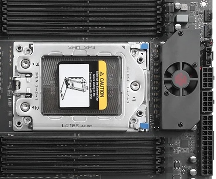
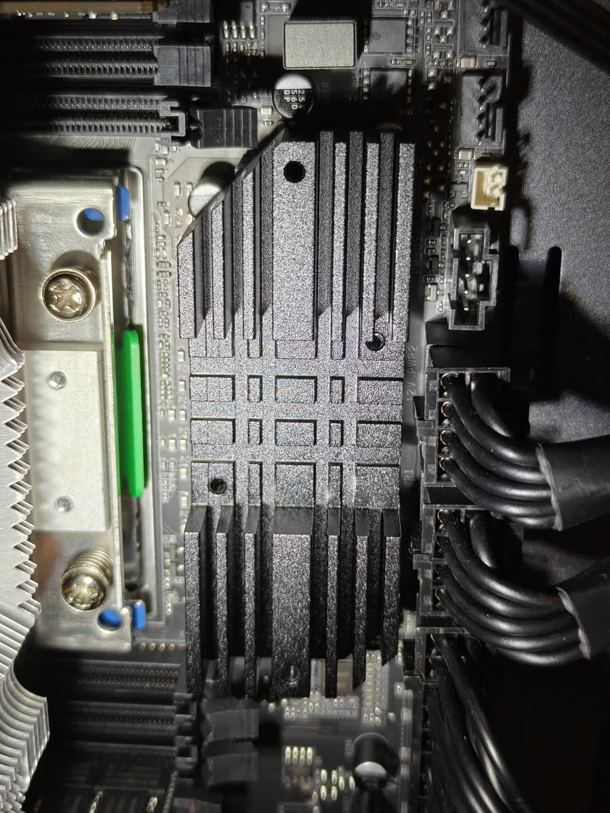
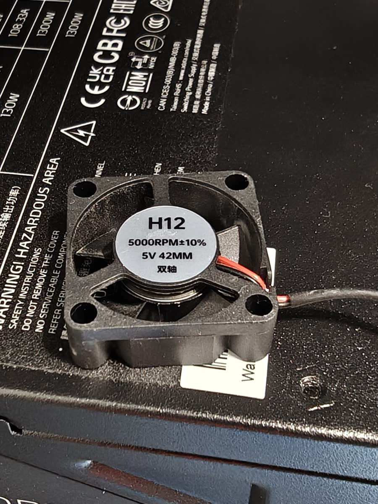
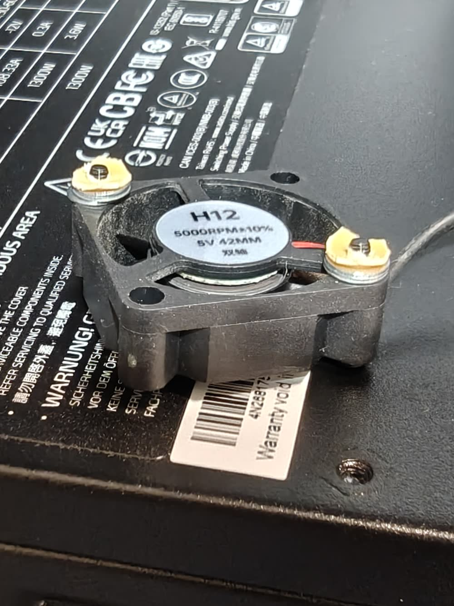
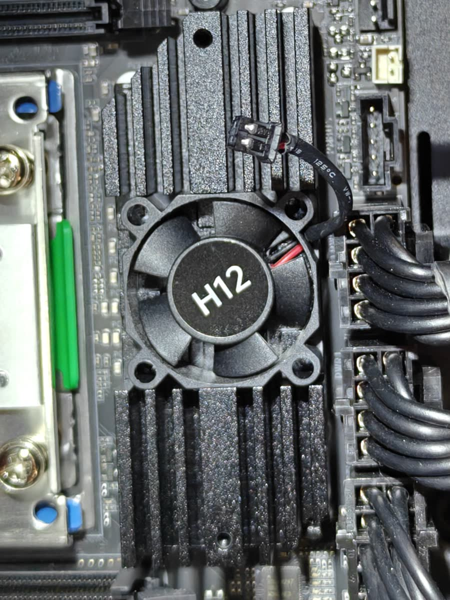
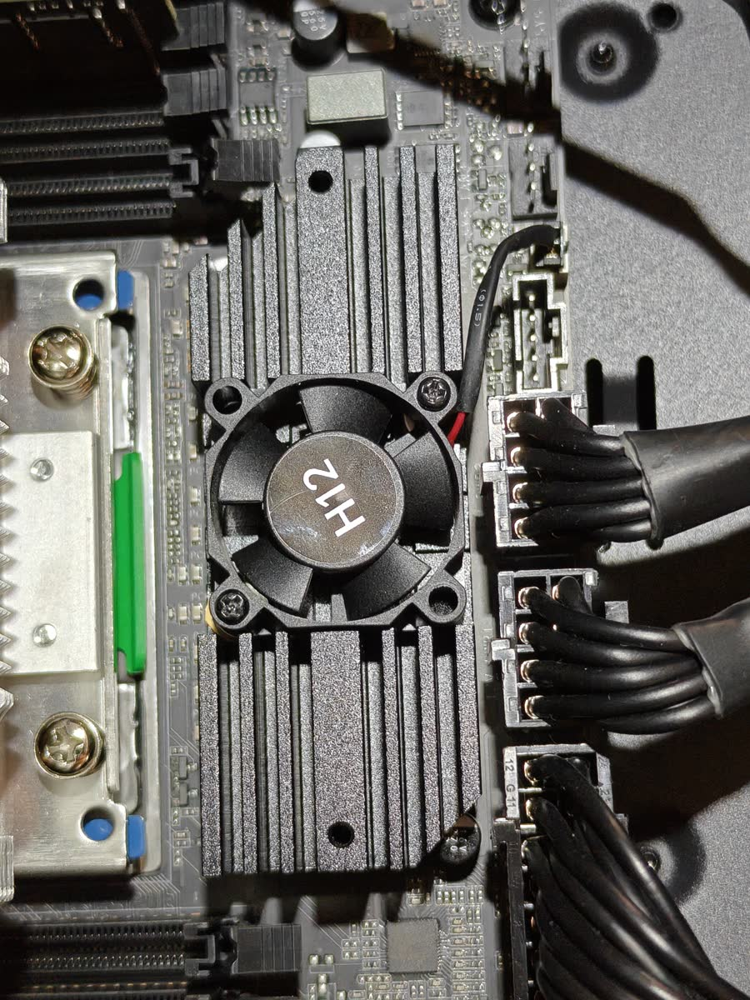

# Доработка охлаждения VRM Huananzhi H12D-8D Ver2.0: меньше шума штатного вентилятора

Небольшая переделка заводского охлаждения зоны питания процессора на материнской плате **Huananzhi H12D-8D Ver2.0** для AMD EPYC с сокетом SP3: открываем рёбра радиатора, облегчаем выход воздуха из-под штатного вентилятора и уменьшаем его шум.

**Модель платы:** HUANANZHI H12D-8D Ver2.0  
**Платформа:** AMD EPYC 7002/7003, Socket SP3  
**Тема:** охлаждение VRM, шум вентилятора, VRM fan mod

## В чём проблема

В заводском исполнении радиатор VRM полностью закрыт декоративной пластиной, а небольшой вентилятор установлен в её центре.

  

На первый взгляд пластина должна работать как воздуховод: вентилятор забирает воздух сверху, нагнетает его под кожух, а затем поток проходит вдоль рёбер радиатора. После снятия накладки выяснилось, что конструкция работает не совсем так.

Под крыльчаткой находится углубление, выход из которого ограничен прорезями шириной около одного миллиметра или меньше. Штатный вентилятор H12 имеет корпус 30 × 30 мм высотой 10 мм; расстояние между противоположными креплениями по диагонали — около 42 мм. Он рассчитан на 5 В и 5000 об/мин. В такой конструкции вентилятор фактически нагнетает воздух в тесный «колодец» с очень маленьким выходным сечением. Значительная часть его работы уходит на преодоление сопротивления, а закрытые накладкой рёбра почти не участвуют в общем потоке воздуха внутри корпуса.

  

  

## Что я изменил

Я снял верхнюю пластину и закрепил штатный вентилятор непосредственно на радиаторе. Под крепления подложил три небольшие шайбы общей толщиной около 1,5 мм. Вместе с фиксатором из оболочки кабеля они приподняли вентилятор над углублением примерно на 2 мм.

Дополнительный зазор уменьшил сопротивление **после** крыльчатки. Теперь воздух по-прежнему забирается сверху, но после нагнетания может свободнее расходиться в стороны и попадать в боковые рёбра. Снятая накладка одновременно открыла весь радиатор для потока от корпусных вентиляторов.

### Небольшая хитрость при сборке

Удерживать несколько шайб на крепёжном винте при установке вентилятора неудобно. Поэтому я сделал простой фиксатор из внешней оболочки кабеля витой пары: обрезал небольшой кусочек по размеру шайб и проделал в нём отверстие под винт. Оболочка плотно удерживает шайбы на винте, упрощая установку всей конструкции, и добавляет ещё около 0,5 мм к зазору.

  

<em>Три шайбы дают около 1,5 мм, а фиксатор из оболочки — ещё примерно 0,5 мм. На фотографии жёлтые фиксаторы удерживают шайбы на винтах.</em>

Возможен и более аккуратный вариант доработки: найти совместимый вентилятор 30 × 30 мм высотой 7 мм. Благодаря меньшей толщине его верхняя часть, вероятно, не будет выступать выше радиатора даже с необходимым зазором снизу. Перед заменой нужно проверить напряжение питания, полярность разъёма, направление потока и расположение крепёжных отверстий.

  

  

### Видео работы

  <video controls playsinline preload="metadata" width="420" poster="images/huananzhi-h12d-8d/final-installation-v2.jpg">
    <source src="images/huananzhi-h12d-8d/vrm-fan-demo-v1.mp4" type="video/mp4">
    Ваш браузер не поддерживает встроенное видео. <a href="images/huananzhi-h12d-8d/vrm-fan-demo-v1.mp4">Открыть видео отдельным файлом</a>.
  </video>

<em>Вентилятор после установки на открытый радиатор.</em>

## Результат

Датчика температуры VRM у этой платы, по всей видимости, нет, поэтому подтвердить разницу в градусах я пока не могу. Субъективно вентилятор стал работать заметно тише — вероятно, благодаря уменьшившемуся противодавлению и более свободному выходу воздуха. Практический бытовой тест тоже пройден: следующую ночь я смог спать, не закрывая дверь в помещение с сервером. Это, конечно, не заменяет измерения шумомером, но хорошо описывает разницу в повседневном использовании.

Основной результат переделки:

- открыт радиатор для общего корпусного потока;
- увеличено выходное сечение под вентилятором;
- воздух получил доступ к боковым рёбрам;
- снизился шум маленького вентилятора.

## Возможное продолжение

Следующим шагом может стать изготовление кастомного радиатора под более качественный и тихий вентилятор Noctua размером 40 × 40 × 10 мм. Радиатор стоит сразу спроектировать так, чтобы вентилятор не упирался в сплошную площадку: под крыльчаткой нужен достаточный зазор, а воздушные каналы должны иметь свободный выход к рёбрам.

Эффективность нынешней и будущей конструкций можно будет сравнить термопарой или тепловизором под одинаковой продолжительной нагрузкой, а уровень шума — шумомером с фиксированного расстояния.

## Если решите повторить

Если вы будете делать такую же доработку, пожалуйста, измерьте температуру и уровень шума **до и после**, а затем поделитесь результатами. Мне возвращать уже переделанную систему в исходное состояние ради сравнительного теста, честно говоря, не хочется 🙂

Для полезного сравнения желательно указать:

- температуру в помещении;
- место и способ измерения температуры VRM;
- нагрузку и её продолжительность;
- расстояние от шумомера до корпуса;
- конфигурацию корпусных вентиляторов.

Результаты можно прислать через Issue или комментарий к публикации — я добавлю их в эту заметку со ссылкой на автора.

> Перед подобной доработкой полностью обесточьте систему. Убедитесь, что шайбы и винты не касаются платы, крыльчатка вращается свободно, а провод вентилятора не попадает в лопасти.
